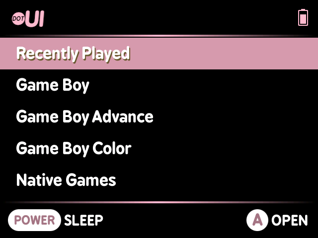
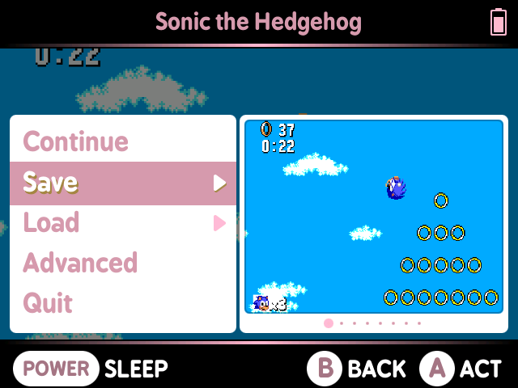

# DotUI

_DotUI is a port of the popular [MiniUI](https://github.com/shauninman/MiniUI) custom launcher and integrated in-game menu, compatible with the [Miyoo Mini Plus](https://www.aliexpress.com/item/1005005215387485.html) handheld emulator_

 

# Important Notice

All support for this port on the Mini Plus will be provided on this project by Xpndable. Please raise issues here, or discuss them on the [Retro Gaming Handhelds discord server](https://discord.gg/retro-game-handhelds-529983248114122762).

# Project Information

This project now has a release candidate, and barring any major bugs or issues found, will be graduated to v1.0 some time after publishing. The download files can be found [here](https://github.com/Xpndable/DotUI/releases)

The following are the list of features that will be worked on to take advantage of the WiFi chip in the Miyoo Mini Plus (in no particular order):
* WiFi configuration tool and OTA updates
* File Transfer tool
* Cloud Saves
* Retroachievements
* RTC Sync
* NetPlay

## Contributing

If you'd like to contribute to the project:
* For bugs, simply raise a pull request and it will be assessed on it's own merits.
* For features, first build and release a .pak as either a Tool or Emu add-on in your own project on GitHub. If you'd then like to have this included in the project as an official extra, raise a pull request that links your code into the `third-party` folder, and include a modified `make` script. This will ensure an ever-green approach to including your work in the DotUI repository.
* If your feature requires modification to the core components such as `keymon`, `batmon`, `main`, `common`, `mmenu` or `msettings`, feel free to discuss with me your ideas in the [Retro Gaming Handhelds discord server](https://discord.gg/retro-game-handhelds-529983248114122762), and we can co-ordinate our combined efforts.